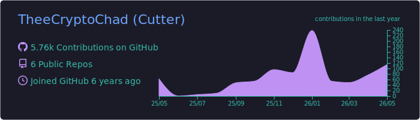
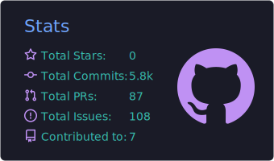
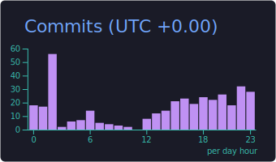
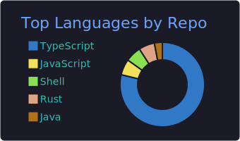
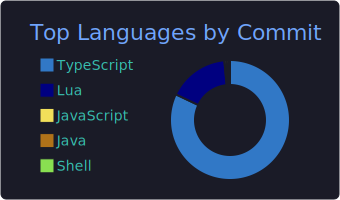

# Hi, I'm Cutter 👋

**Full-stack engineer & technical founder · Building scalable products through [Bitforge](https://www.bitforge.studio)**

---

I'm a full-stack software engineer and technical founder with 5+ years of experience building scalable software across startups, solo founders, and internal teams.

Through my studio, **Bitforge**, I've delivered 10+ full-stack applications — ranging from SaaS MVPs and internal tools to developer infrastructure and real-time data systems.

---

## 🛠️ Tech Stack

### Languages

### Frontend

### Backend & Databases

### Cloud & Infrastructure

### Tooling & OS

### Blockchain

### Additional Libraries & Tools

---

## 📊 GitHub Stats

  
   
  
  
   
  
  

---

## 📫 Let's Connect

